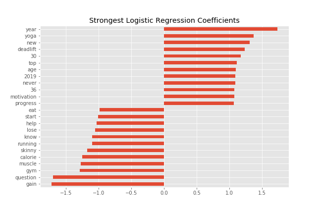
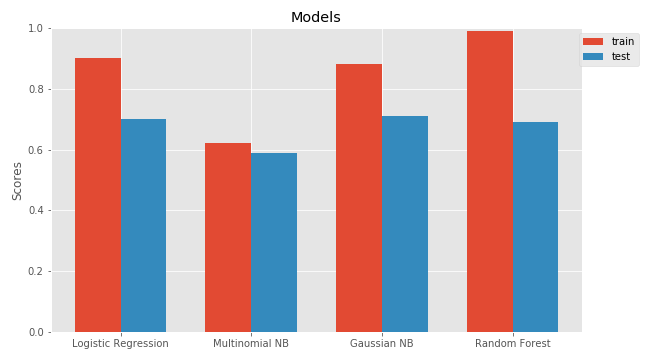
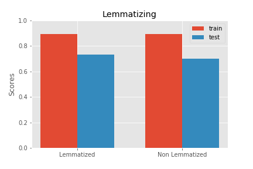
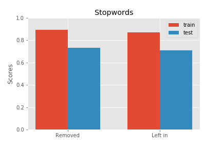
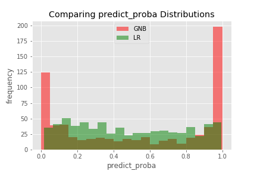

# Project 3 README

## Table of Contents
[1.0 Directory Structure](#10-Directory-Structure)<br>
[2.0 Executive Summary](#20-Executive-Summary)<br>
[3.0 Description of Data](#30-Description-of-Data)<br>
-[3.1 Size](#31-Size)<br>
-[3.2 Source](#32-Source)<br>
-[3.3 Data Dictionary](#33-Data-Dictionary)<br>
[4.0 Data Visualization](#40-Data-Visualization)<br>
[5.0 Conclusion](#50-Conclusion)<br>
[6.0 Outside Sources](#60-Outside-Sources)<br>

## 1.0 Directory Structure

```
.
├── project_3
    ├── code
        ├── reading_cleaning.ipynb
        ├── eda_modeling.ipynb
    ├── datasets
        ├── df.csv
    ├── plots
        ├── coefficients.png
        ├── estimators.png
        ├── lemmatizing.png
        ├── stopwords.png
        ├── predict_proba.png
    ├── README.md
    └── project3_slides.pdf
```

## 2.0 Executive Summary

Fitness represents a $30 billion industry in the U.S. alone, and is growing rapidly. Many Americans are more becoming more health conscious in 2020. Between niche gyms, obstacle races, and apps like Just Play, where one can find a team for casual sports, there is something in this industry for everyone. Each person has his or her own reasons for wanting to improve their own physical fitness. There are some people who just want to improve their overall health and longevity, and some who want to be competitive powerlifters, and everything in between. Reddit has many communities for fitness related topics. The most general of them is /r/fitness. Another community is /r/fitness30plus, which is reserved for fitness topics more relevant to individuals over the age of 30. Clearly, these groups should not be marketed to in the exact same way. By creating a machine learning model to accurately distinguish between the general fitness enthusiasts and those concerned with age-related factors, we hope to make our marketing efforts more user-specific and effective.

---
## 3.0 Description of Data

### 3.1 Size
1000 posts from r/fitness <br>
1000 posts from r/fitness30plus <br>

### 3.2 Source

reddit.com/r/fitness <br>
reddit.com/r/fitness30plus

### 3.3 Data Dictionary

|Feature|Type|Description|
|---|---|---|
|title|object|Title of post|
|selftext|object|Body of post|
|alltext|object|'title' + 'selftext'|
|created_utc|datetime|The date and time at which the post was created|
|tokenized|list|'alltext' converted to a list of words|
|tokens_lem|list|Lemmatized each word in 'tokenized'|
|nostops|list|'tokens_lem' with stopwords removed|
|nostopstring|object|Words from 'nostops' joined back together as a string|
|subreddit|int|The subreddit from which the post originated. 0 for /r/fitness, 1 for /r/fitness30plus|

---
## 4.0 Data Visualization







---
## 5.0 Conclusion

The most accurate model was reached by first using data transformers such as the tokenizer, lemmatizer, a custom function for filtering stopwords, and a TFIDF (Term Frequency - Inverse Document Frequency) Vectorizer. The models explored were logistic regression, Multinomial Naive Bayes, Gaussian Naive Bayes, K-Nearest-Neighbors, and Random Forest. The best test result was achieved with Gaussian Naive Bayes. This approach yielded an accuracy score of 0.89 on our training data, and 0.73 on our testing data, with 0.5 as our benchmark accuracy. Using this model, we hope to improve our marketing efforts by accurately distinguishing the posters of r/fitness, and those from r/fitness30plus.

---
## 6.0 Outside Sources

- https://medium.com/@cristhianboujon/how-to-list-the-most-common-words-from-text-corpus-using-scikit-learn-dad4d0cab41d
- https://www.forbes.com/sites/benmidgley/2018/09/26/the-six-reasons-the-fitness-industry-is-booming/#33a08c27506d
- https://stats.stackexchange.com/questions/399722/why-naive-bayes-classifier-is-known-to-be-a-bad-estimator